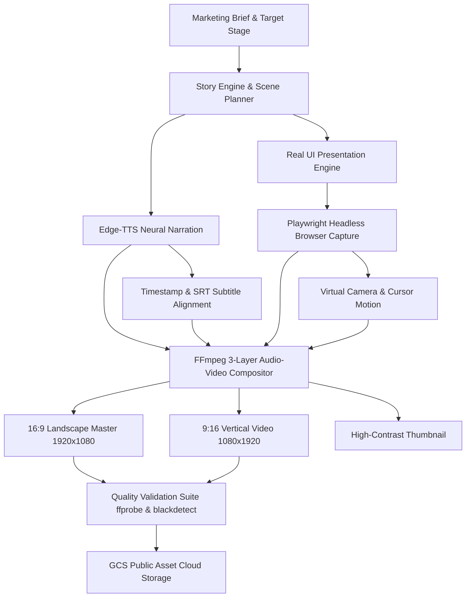

# MarketPulse: Product Demo Video Generator — Workflow & Pipeline Architecture

## 1. Executive Summary

The **Product Demo Video Generator** is an automated video production system engineered for **My Digital Identity** (`https://mydigitalidentity.co.in`). It transforms product features, user journey stages, and marketing objectives into high-production-value video assets across multiple aspect ratios (16:9 Landscape & 9:16 Vertical Shorts/Reels).

---

## 2. End-to-End Pipeline Workflow



---

## 3. Core System Components

### 3.1. Authentic UI Capture Engine
* **Source**: Real UI captures from the live production platform (`https://mydigitalidentity.co.in`).
* **Storage**: [`marketing/video/assets/live_platform_screenshots/`](file:///config/Desktop/BuildWithGemini/marketpulse/marketing/video/assets/live_platform_screenshots/)
  * `01_hero.png`: Brand introduction & identity tagline
  * `02_features.png`: ATS-ready resume builder
  * `03_ats_section.png`: ATS score & profile analytics
  * `04_portfolio_themes.png`: Shareable portfolio website & themes
  * `05_cta_footer.png`: Conversion CTA & custom link

### 3.2. Motion & Camera Director
* **Module**: [`marketing/video/camera.py`](file:///config/Desktop/BuildWithGemini/marketpulse/marketing/video/camera.py)
* **Virtual Camera**: Smooth pan/zoom transitions (`focus()`, `reset()`, `spotlight()`) targeting active UI cards.
* **Cursor Automation**: [`marketing/video/cursor.py`](file:///config/Desktop/BuildWithGemini/marketpulse/marketing/video/cursor.py) simulating human ease-in-out movement and click ripples.

### 3.3. Multi-Track Audio Engine
* **Module**: [`marketing/video/audio/audio_engine.py`](file:///config/Desktop/BuildWithGemini/marketpulse/marketing/video/audio/audio_engine.py)
* **Track 1 (Narration)**: High-clarity neural voiceover synthesized with `edge-tts` (`en-US-GuyNeural`).
* **Track 2 (Music Bed)**: Procedural ambient chord progression (Cmaj7 → Am7 → Fmaj7 → Gsus4) at `-18dB`.
* **Track 3 (UI SFX)**: Procedurally synthesized button clicks (950Hz) and achievement chimes (659Hz).

### 3.4. Output Formats
* **16:9 Landscape Video**: 1920 × 1080 @ 60 FPS (YouTube, Web, Desktop)
* **9:16 Vertical Video**: 1080 × 1920 (YouTube Shorts, Instagram Reels, TikTok)
* **Subtitles**: Timestamped `.srt` files synchronized to voiceover
* **Thumbnails**: 1920 × 1080 JPG/PNG frame captures at peak visual moments

---

## 4. Execution & Orchestration

To run the pipeline locally:
```bash
PYTHONPATH=/config/Desktop/BuildWithGemini /tmp/video_env/bin/python3 -m marketpulse.marketing.video.renderer
```

Or for real platform screenshot compositions:
```bash
PYTHONPATH=/config/Desktop/BuildWithGemini /tmp/video_env/bin/python3 /tmp/record_real_screenshot_video.py
```
